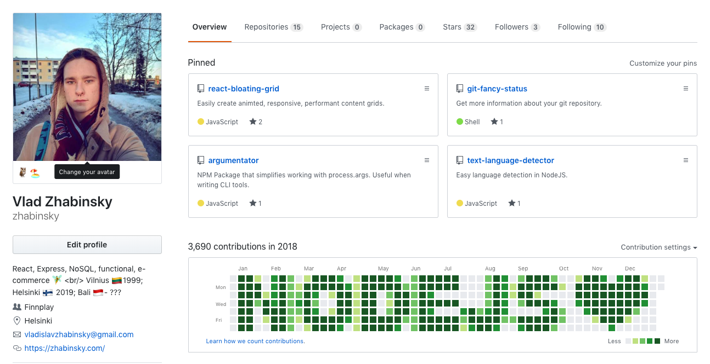
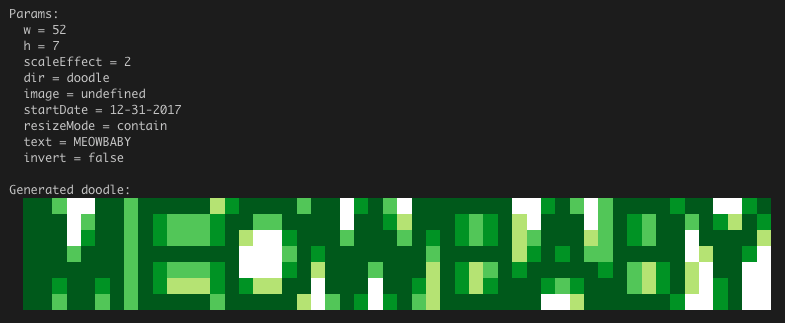
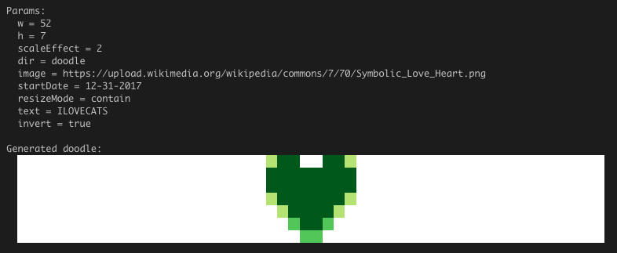

# Github doodle
Generate a custom pattern for your github contributions history from **text** or **image**.

[npmjs](https://www.npmjs.com/package/github-doodle)   
[github](https://github.com/zhabinsky/github-doodle#readme)   


## Example


## Install

```
$ npm i -g github-doodle
```

## Use

1) From text
```
github-doodle --text="MEOWBABY"
```
### Output:
   
2) From image
```
github-doodle --invert\
--image=https://upload.wikimedia.org/wikipedia/commons/7/70/Symbolic_Love_Heart.png 
```
### Output:


## Add to github
1) Create empty github repository

2) Push created doodle
```
$ cd doodle
$ git remote add origin <YOUR_GITHUB_REPO>
$ git push -u origin master
```

## Parameters

```
Flags:                   Description:                                        
-----------------------  ----------------------------------------------------
--image=undefined        Sets image name or url (Optional if --text is given)
--text=ILOVECATS         Sets text to generate (Optional if --image is given)
--start-date=12-31-2017  Sets first commit date (MM-DD-YYYY)                 
--dir=doodle             Sets output repository path                         
--effect-scale=2         Sets commits multiplier (recommended < 6)           
--resize-mode=contain    Sets image resize mode (cover, contain)             
--w=52                   Sets output image width                             
--invert=false           Sets colors to inverse                              
--h=7                    Sets output image height                            
--manual, --man          Shows all available CLI arguments                   
```